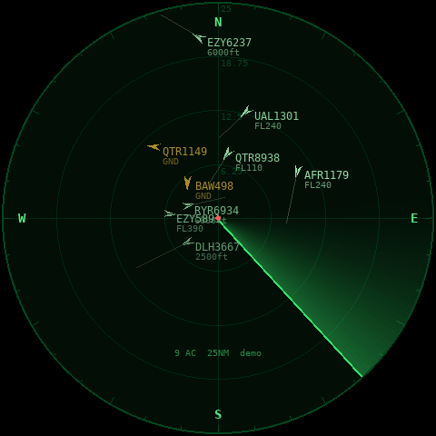

# Flight Radar

A tiny round radar display that plots nearby aircraft and their callsigns using live
ADS-B data, fetched over Wi-Fi every 5 seconds. It's built for a Raspberry Pi and runs
either as a small borderless circle on your desktop or full screen on a round display.



- **Live data** comes from [airplanes.live](https://airplanes.live), with [adsb.lol](https://adsb.lol) as a fallback. Both are free and need no API key.
- **A sweep line** rotates, and each blip brightens as the sweep passes over it.
- **Each aircraft** is drawn as an arrow pointing along its track, with a line showing about one minute of travel ahead. Its label shows the callsign and its altitude (or flight level).
- **Aircraft on the ground** are amber. Your position is the red dot in the centre.
- **Smooth motion:** between 5 s updates, positions are dead-reckoned from speed and track.

## Run it

```bash
# On Raspberry Pi OS
sudo apt install python3-pygame
# (or anywhere else: pip install -r requirements.txt)

python3 radar.py --demo                          # simulated traffic, no network needed
python3 radar.py --lat 60.3172 --lon 24.9633     # live, around your location
```

Find your coordinates by right-clicking a spot in Google Maps.

| Option | Default | |
|---|---|---|
| `--lat` / `--lon` | Heathrow | Centre of the radar (or env `RADAR_LAT` / `RADAR_LON`) |
| `--range` | 25 | Radius in nautical miles |
| `--size` | 480 | Window diameter in px |
| `--pos 20,20` | last spot | Window position on the desktop (normally you just drag it) |
| `--fullscreen` | off | Fill the screen, which suits a round display |
| `--rotate` | 0 | Rotate output 90/180/270 for a mounted screen |
| `--interval` | 5 | Seconds between fetches |
| `--demo` | off | Fake aircraft |

**Controls:** `+`/`-` or the mouse wheel zoom (5–250 nm). Drag the circle to move it, and it
reopens in the same spot next time. A click (without dragging) cycles the range,
`L` toggles labels, and `Esc`/`Q` quits.

## Start on boot

**Desktop Pi.** One command installs pygame, adds Flight Radar to the app menu, sets it to
start when you log in, and launches it:

```bash
./install.sh <lat> <lon> [range_nm] [size_px]     # e.g. ./install.sh 60.3172 24.9633 25 360
./install.sh --uninstall                          # remove the menu and autostart entries
```

Run it again with new values to change your location or size.

**Headless Pi with a round screen.** Examples are the Pimoroni HyperPixel 2.1 Round
(480×480) or a Waveshare round HDMI/DSI panel. Edit `flight-radar.service`, then run:

```bash
sudo cp flight-radar.service /etc/systemd/system/
sudo systemctl enable --now flight-radar
```

## Notes

- The data is crowd-sourced ADS-B, so coverage depends on volunteer receivers near you.
  airplanes.live allows non-commercial use and roughly 1 request per second, so 5 s polling is fine.
- Want your *own* data? Add an RTL-SDR dongle and run `readsb`/`tar1090` on the Pi. It serves
  the same JSON format at `http://localhost/tar1090/data/aircraft.json`, which could be added as a source in `feeds.py`.
- If the window won't stay where you drag it on the newer Pi OS desktop (Wayland), try launching
  with `SDL_VIDEODRIVER=x11` set in front of the command.
